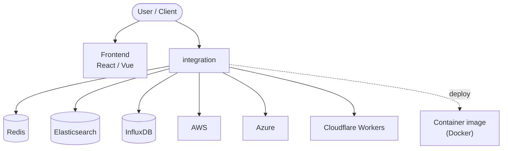

# HACS (Home Assistant Community Store)

_Manage (Install, track, upgrade) and discover custom elements for Home Assistant directly from the UI._

## What?

HACS is an integration that gives the user a powerful UI to handle downloads of custom needs.

**Highlights of what HACS can do:**

- Help you discover new custom elements.
- Help you download new custom elements.
- Help you keep track of your custom elements.
  - Manage(download/update/remove)
  - Shortcuts to repositories/issue tracker

## Useful links

- [General documentation](https://hacs.xyz/)
- [Configuration](https://hacs.xyz/docs/use/configuration/basic)
- [FAQ](https://hacs.xyz/docs/faq)
- [GitHub](https://github.com/hacs)
- [Discord](https://discord.gg/apgchf8)
- [Become a GitHub sponsor? ❤️](https://github.com/sponsors/ludeeus)
- [BuyMe~~Coffee~~Beer? 🍺🙈](https://buymeacoffee.com/ludeeus)

## Issues

~~If~~ When you experience issues/bugs with this the best way to report them is to open an issue in **this** repo.

[Issue link](https://hacs.xyz/docs/help/issues)

<!-- ARCH-DIAGRAM:START -->

## Architecture

> Auto-generated architecture diagram. See [`docs/context-map.md`](docs/context-map.md) for the full context map (core application, containers/cloud, and database connections).

<!-- ARCH-DIAGRAM:END -->
