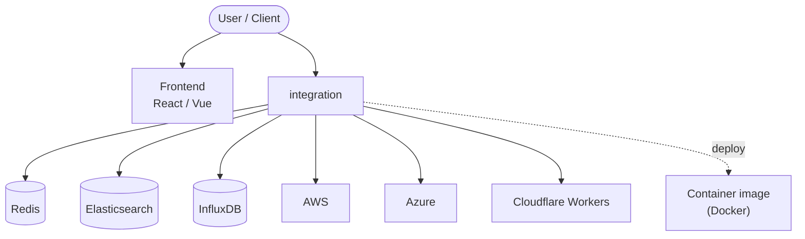

# Context Map — `integration`

> Auto-generated architecture & deployment context map. Summarizes the core application, container/cloud footprint, and database connections. Regenerate after significant structural changes.

**Repo:** `avnit/integration` · **Fork** · Public · Primary language: Python · Default branch: `main` · Files: 764

**Description:** HACS gives you a powerful UI to handle downloads of all your custom needs.

## 1. Core application

HACS (Home Assistant Community Store)

- **Frameworks / runtime:** React, Vue

## 2. Containers & cloud applications

**Containers:**
- `.dockerignore`
- `action/Dockerfile`

**Detected cloud platforms / services:** AWS, Azure, Cloudflare Workers

## 3. Database connections

**Datastores in use:** Redis, Elasticsearch, InfluxDB

**Referenced in:**
- `tests/fixtures/v2-appdaemon-data.json`
- `tests/fixtures/v2-integration-data.json`

## 4. Architecture diagram

## 5. Security posture

- **Static scan findings:** 1 high

| Severity | Rule | File:Line |
|---|---|---|
| high | curl-pipe-shell | `.github/workflows/pytest.yml:99` |

---
_Generated by repo context-mapping pass on 2026-08-13._